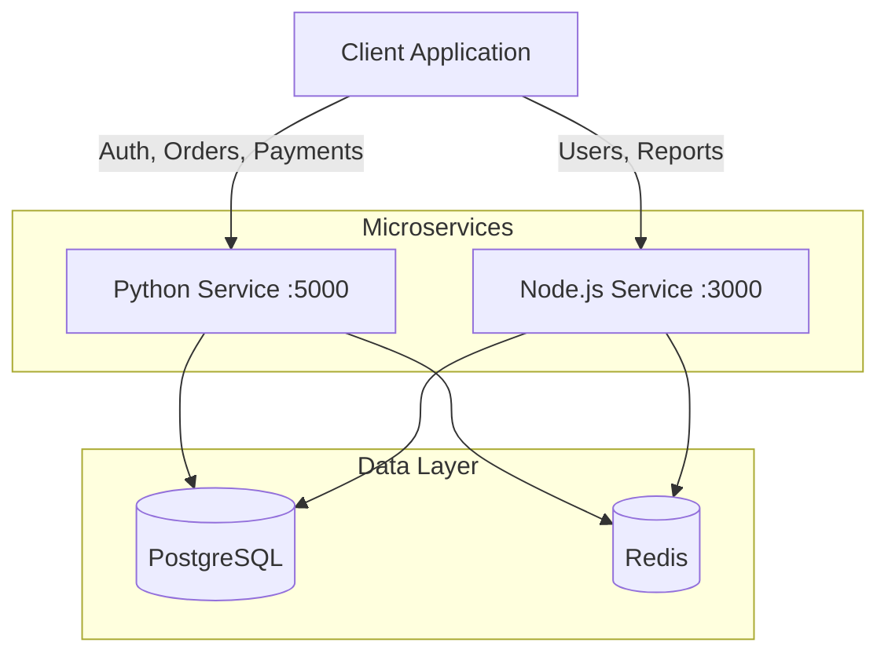

## Microservices Overview

ShopStack Platform implements a **polyglot microservices architecture** where two independent services handle different business domains while sharing a common data layer.



## Service Responsibilities

<CardGroup cols={2}>
  <Card title="Python Service" icon="python">
    **Domain Focus:** Transactional operations
    
    - User authentication & JWT issuing
    - Product catalog management
    - Order creation & tracking
    - Payment processing & calculations
    - Tax & discount logic
  </Card>
  
  <Card title="Node.js Service" icon="node-js">
    **Domain Focus:** User operations & analytics
    
    - User profile management
    - Product search & discovery
    - Sales reporting
    - Analytics & metrics
    - Health monitoring
  </Card>
</CardGroup>

## Technology Stack

### Python Service Stack

<AccordionGroup>
  <Accordion title="Web Framework" icon="flask">
    **Flask 2.3.0+**
    
    Lightweight WSGI web framework with:
    - Blueprint-based route organization
    - Custom JSON encoder for datetime and Decimal types
    - Application factory pattern for testing
    
    ```python app/__init__.py
    from flask import Flask
    from flask_sqlalchemy import SQLAlchemy
    from flask_jwt_extended import JWTManager
    from flask_cors import CORS
    
    db = SQLAlchemy()
    jwt = JWTManager()
    
    def create_app(config_name=None):
        app = Flask(__name__)
        app.config.from_object(get_config(config_name))
        
        db.init_app(app)
        jwt.init_app(app)
        CORS(app)
        
        # Register blueprints
        app.register_blueprint(auth_bp, url_prefix="/api/auth")
        app.register_blueprint(products_bp, url_prefix="/api/products")
        app.register_blueprint(orders_bp, url_prefix="/api/orders")
        app.register_blueprint(payments_bp, url_prefix="/api/payments")
        
        return app
    ```
  </Accordion>
  
  <Accordion title="ORM & Database" icon="database">
    **Flask-SQLAlchemy 3.1.1**
    
    Database abstraction with support for:
    - PostgreSQL (production) via psycopg2-binary
    - SQLite (testing) for isolated test runs
    - Automatic table creation
    - Model relationships and lazy loading
    
    **Configuration:**
    - Development: SQLite in-memory database
    - Production: PostgreSQL with connection pooling
    - Test: SQLite in-memory with fixtures
  </Accordion>
  
  <Accordion title="Authentication" icon="key">
    **Flask-JWT-Extended 4.6.0**
    
    JWT token management with:
    - Access token generation
    - Token verification middleware
    - User identity resolution
    - bcrypt password hashing (4.1.2)
    
    Tokens include user ID and role for authorization checks.
  </Accordion>
</AccordionGroup>

### Node.js Service Stack

<AccordionGroup>
  <Accordion title="Web Framework" icon="node">
    **Express 4.18.2**
    
    Minimal and flexible Node.js framework with:
    - Route-based organization
    - Middleware chain for auth and validation
    - Global error handling
    
    ```javascript src/index.js
    const express = require("express");
    const cors = require("cors");
    const { sequelize } = require("./models");
    
    const app = express();
    
    app.use(cors({ origin: "http://localhost:3000", credentials: true }));
    app.use(express.json());
    
    // Routes
    app.use("/api/auth", authRoutes);
    app.use("/api/users", userRoutes);
    app.use("/api/products", productRoutes);
    app.use("/api/reports", reportRoutes);
    
    // Global error handler
    app.use((err, req, res, _next) => {
      console.error("Unhandled error:", err);
      res.status(500).json({
        error: "Internal server error",
        message: process.env.NODE_ENV === "development" ? err.message : undefined
      });
    });
    ```
  </Accordion>
  
  <Accordion title="ORM & Database" icon="database">
    **Sequelize 6.35.0**
    
    Promise-based ORM with:
    - Model definition and associations
    - Automatic migrations
    - PostgreSQL support via pg driver
    - SQLite for testing
    
    **Model Example:**
    ```javascript src/models/index.js
    const User = sequelize.define("User", {
      id: { type: DataTypes.INTEGER, primaryKey: true, autoIncrement: true },
      email: { type: DataTypes.STRING, allowNull: false, unique: true },
      passwordHash: { type: DataTypes.STRING, allowNull: false },
      name: { type: DataTypes.STRING, allowNull: false },
      role: { type: DataTypes.STRING, defaultValue: "customer" }
    });
    ```
  </Accordion>
  
  <Accordion title="Authentication" icon="shield">
    **jsonwebtoken 9.0.2**
    
    JWT implementation with:
    - Token signing and verification
    - Expiration handling
    - bcryptjs for password hashing
    - express-validator for input validation
    
    Supports the same JWT format as Python service for potential token sharing.
  </Accordion>
</AccordionGroup>

## Database Schema

Both services share a unified PostgreSQL database with the following core tables:

### Users Table

```sql
CREATE TABLE users (
    id SERIAL PRIMARY KEY,
    email VARCHAR(255) NOT NULL UNIQUE,
    password_hash VARCHAR(255) NOT NULL,
    name VARCHAR(255) NOT NULL,
    role VARCHAR(50) DEFAULT 'customer',
    profile JSON,  -- Node.js only
    created_at TIMESTAMP DEFAULT NOW(),
    updated_at TIMESTAMP DEFAULT NOW()
);

CREATE INDEX idx_users_email ON users(email);
```

<Info>
  The `profile` field is a JSON column used by the Node.js service for storing extended user metadata.
</Info>

### Products Table

```sql
CREATE TABLE products (
    id SERIAL PRIMARY KEY,
    name VARCHAR(255) NOT NULL,
    description TEXT,
    price NUMERIC(10, 2) NOT NULL,
    stock INTEGER DEFAULT 0,
    category VARCHAR(100),
    created_at TIMESTAMP DEFAULT NOW(),
    updated_at TIMESTAMP DEFAULT NOW()
);

CREATE INDEX idx_products_category ON products(category);
```

### Orders Table

```sql
CREATE TABLE orders (
    id SERIAL PRIMARY KEY,
    user_id INTEGER NOT NULL REFERENCES users(id),
    status VARCHAR(50) DEFAULT 'pending',
    subtotal NUMERIC(10, 2) NOT NULL,
    tax NUMERIC(10, 2) DEFAULT 0,
    total NUMERIC(10, 2) NOT NULL,
    created_at TIMESTAMP DEFAULT NOW(),
    updated_at TIMESTAMP DEFAULT NOW()
);

CREATE INDEX idx_orders_user_id ON orders(user_id);
CREATE INDEX idx_orders_status ON orders(status);
```

### Order Items Table

```sql
CREATE TABLE order_items (
    id SERIAL PRIMARY KEY,
    order_id INTEGER NOT NULL REFERENCES orders(id),
    product_id INTEGER NOT NULL REFERENCES products(id),
    quantity INTEGER NOT NULL,
    price_at_time NUMERIC(10, 2) NOT NULL,
    created_at TIMESTAMP DEFAULT NOW()
);

CREATE INDEX idx_order_items_order_id ON order_items(order_id);
```

## Service Communication

### Shared Database Pattern

Both services communicate primarily through the **shared database**:

<Steps>
  <Step title="Write Operations">
    Each service writes to tables within its domain:
    - Python service creates/updates: products, orders, order_items
    - Node.js service creates/updates: users, user profiles
  </Step>
  
  <Step title="Read Operations">
    Both services can read from all tables:
    - Python service reads user data for authentication
    - Node.js service reads products and orders for reporting
  </Step>
  
  <Step title="Consistency">
    Database transactions ensure consistency:
    - Order creation with items is atomic
    - User registration with profile is transactional
  </Step>
</Steps>

<Warning>
  While both services can access all tables, domain boundaries should be respected. Avoid having both services write to the same table to prevent conflicts.
</Warning>

### Redis for Cross-Service Communication

Redis is used for:

<CardGroup cols={2}>
  <Card title="Session Storage" icon="clock">
    JWT tokens and session data with TTL expiration
  </Card>
  <Card title="Caching" icon="bolt">
    Frequently accessed data like product catalogs
  </Card>
  <Card title="Pub/Sub" icon="broadcast-tower">
    Event notifications between services (future enhancement)
  </Card>
  <Card title="Rate Limiting" icon="gauge">
    API rate limiting and throttling
  </Card>
</CardGroup>

**Redis Configuration:**
```yaml docker-compose.yml
redis:
  image: redis:7-alpine
  ports:
    - "6379:6379"
  healthcheck:
    test: ["CMD", "redis-cli", "ping"]
    interval: 5s
```

## API Endpoints Overview

### Python Service Endpoints (Port 5000)

<AccordionGroup>
  <Accordion title="Authentication" icon="key">
    | Method | Endpoint | Auth | Description |
    |--------|----------|------|-------------|
    | POST | `/api/auth/register` | No | Register new user |
    | POST | `/api/auth/login` | No | Login and get JWT |
    | GET | `/api/auth/me` | JWT | Get current user |
  </Accordion>
  
  <Accordion title="Products" icon="box">
    | Method | Endpoint | Auth | Description |
    |--------|----------|------|-------------|
    | GET | `/api/products/` | No | List products (paginated) |
    | GET | `/api/products/<id>` | No | Get product by ID |
    | GET | `/api/products/search?q=` | No | Search products |
    | POST | `/api/products/` | JWT | Create product |
  </Accordion>
  
  <Accordion title="Orders" icon="shopping-cart">
    | Method | Endpoint | Auth | Description |
    |--------|----------|------|-------------|
    | GET | `/api/orders/` | JWT | List user's orders |
    | GET | `/api/orders/<id>` | JWT | Get order by ID |
    | POST | `/api/orders/` | JWT | Create new order |
  </Accordion>
  
  <Accordion title="Payments" icon="credit-card">
    | Method | Endpoint | Auth | Description |
    |--------|----------|------|-------------|
    | POST | `/api/payments/calculate` | JWT | Calculate total with tax/discount |
    | POST | `/api/payments/checkout` | JWT | Process payment for order |
  </Accordion>
</AccordionGroup>

### Node.js Service Endpoints (Port 3000)

<AccordionGroup>
  <Accordion title="Authentication" icon="key">
    | Method | Endpoint | Auth | Description |
    |--------|----------|------|-------------|
    | POST | `/api/auth/register` | No | Register new user |
    | POST | `/api/auth/login` | No | Login and get JWT |
  </Accordion>
  
  <Accordion title="Users" icon="user">
    | Method | Endpoint | Auth | Description |
    |--------|----------|------|-------------|
    | GET | `/api/users/:id` | JWT | Get user by ID |
    | GET | `/api/users/me/profile` | JWT | Get current user profile |
    | PUT | `/api/users/me/profile` | JWT | Update user profile |
  </Accordion>
  
  <Accordion title="Products" icon="box">
    | Method | Endpoint | Auth | Description |
    |--------|----------|------|-------------|
    | GET | `/api/products` | No | List products (paginated) |
    | GET | `/api/products/search?q=` | No | Search products |
    | GET | `/api/products/:id` | No | Get product by ID |
    | POST | `/api/products` | JWT | Create product |
  </Accordion>
  
  <Accordion title="Reports" icon="chart-line">
    | Method | Endpoint | Auth | Description |
    |--------|----------|------|-------------|
    | GET | `/api/reports/sales` | JWT | Generate sales report |
  </Accordion>
  
  <Accordion title="Health" icon="heart-pulse">
    | Method | Endpoint | Auth | Description |
    |--------|----------|------|-------------|
    | GET | `/api/health` | No | Service health check |
  </Accordion>
</AccordionGroup>

## Deployment Architecture

### Docker Compose Setup

The platform uses Docker Compose for orchestration with health checks and dependency management:

```yaml docker-compose.yml
version: "3.8"

services:
  postgres:
    image: postgres:15-alpine
    environment:
      POSTGRES_USER: appuser
      POSTGRES_PASSWORD: apppassword
      POSTGRES_DB: ecommerce
    ports:
      - "5432:5432"
    healthcheck:
      test: ["CMD-SHELL", "pg_isready -U appuser -d ecommerce"]
      interval: 5s

  redis:
    image: redis:7-alpine
    ports:
      - "6379:6379"
    healthcheck:
      test: ["CMD", "redis-cli", "ping"]
      interval: 5s

  python-service:
    build: ./python-service
    ports:
      - "5000:5000"
    environment:
      - DATABASE_HOST=postgres
      - REDIS_URL=redis://redis:6379/0
      - FLASK_ENV=staging
    depends_on:
      postgres:
        condition: service_healthy
      redis:
        condition: service_healthy

  node-service:
    build: ./node-service
    ports:
      - "3000:3000"
    environment:
      - DB_HOST=postgres
      - REDIS_URL=redis://redis:6379/1
      - NODE_ENV=production
    depends_on:
      postgres:
        condition: service_healthy
      redis:
        condition: service_healthy
```

<Note>
  Services use different Redis database indices (0 and 1) to isolate their cached data.
</Note>

### Testing Architecture

Both services use in-memory SQLite databases for testing to ensure:

<CardGroup cols={2}>
  <Card title="Isolation" icon="lock">
    Each test run has a fresh database with no shared state
  </Card>
  <Card title="Speed" icon="rocket">
    In-memory databases are significantly faster than PostgreSQL
  </Card>
  <Card title="Portability" icon="laptop">
    No external dependencies required to run tests
  </Card>
  <Card title="Fixtures" icon="database">
    Test data is loaded from fixtures in conftest.py/test setup
  </Card>
</CardGroup>

**Python Test Configuration:**
```python tests/conftest.py
@pytest.fixture
def app():
    app = create_app('testing')
    with app.app_context():
        db.create_all()
        yield app
        db.session.remove()
        db.drop_all()
```

**Node.js Test Configuration:**
```javascript jest.config.js
module.exports = {
  testEnvironment: 'node',
  coveragePathIgnorePatterns: ['/node_modules/'],
  testTimeout: 10000
};
```

## Scalability Considerations

<AccordionGroup>
  <Accordion title="Horizontal Scaling">
    Both services are stateless and can be scaled horizontally:
    
    - Deploy multiple instances behind a load balancer
    - Use Redis for shared session state
    - Database connection pooling prevents resource exhaustion
    - JWT tokens eliminate session affinity requirements
  </Accordion>
  
  <Accordion title="Database Optimization">
    - Indexes on frequently queried columns (email, category, user_id)
    - Connection pooling with configurable pool size
    - Read replicas for report generation (Node.js service)
    - Prepared statements prevent SQL injection and improve performance
  </Accordion>
  
  <Accordion title="Caching Strategy">
    - Redis caching for product catalogs and user sessions
    - TTL-based cache invalidation
    - Cache-aside pattern for frequently accessed data
    - Separate Redis databases per service for isolation
  </Accordion>
  
  <Accordion title="Monitoring & Health">
    - Health check endpoints for container orchestration
    - Database connection health verification
    - Error logging with context for debugging
    - Request/response logging in development mode
  </Accordion>
</AccordionGroup>

## Security Architecture

<CardGroup cols={2}>
  <Card title="Authentication" icon="key">
    - bcrypt password hashing with salt rounds
    - JWT tokens with expiration
    - Secure secret key storage via environment variables
  </Card>
  
  <Card title="Authorization" icon="shield">
    - Role-based access control (customer, admin)
    - JWT middleware validates tokens on protected routes
    - User-scoped operations (users can only access their orders)
  </Card>
  
  <Card title="Input Validation" icon="check">
    - express-validator for Node.js request validation
    - Marshmallow schemas for Python data validation
    - SQL injection prevention via ORM parameterization
  </Card>
  
  <Card title="CORS" icon="globe">
    - Configurable CORS policies
    - Credential support for authenticated requests
    - Origin whitelisting in production
  </Card>
</CardGroup>

## Repository Structure

```
├── docker-compose.yml              # Container orchestration
├── python-service/
│   ├── app/
│   │   ├── __init__.py             # App factory with extensions
│   │   ├── config.py               # Environment-based configuration
│   │   ├── models/                 # SQLAlchemy models
│   │   │   ├── user.py
│   │   │   ├── product.py
│   │   │   └── order.py
│   │   ├── routes/                 # Blueprint route handlers
│   │   │   ├── auth.py
│   │   │   ├── products.py
│   │   │   ├── orders.py
│   │   │   └── payments.py
│   │   └── services/               # Business logic
│   ├── tests/                      # Pytest test suite
│   ├── requirements.txt
│   └── run.py
├── node-service/
│   ├── src/
│   │   ├── index.js                # Express app setup
│   │   ├── config.js               # Configuration
│   │   ├── models/                 # Sequelize models
│   │   │   └── index.js
│   │   ├── routes/                 # Route handlers
│   │   │   ├── auth.js
│   │   │   ├── users.js
│   │   │   ├── products.js
│   │   │   └── reports.js
│   │   ├── middleware/             # Auth & validation
│   │   └── services/               # Business logic
│   ├── tests/                      # Jest test suite
│   └── package.json
└── incidents/                      # Incident tickets (JSON)
```

<Info>
  The `incidents/` directory contains structured JSON tickets for issue tracking and resolution workflows.
</Info>